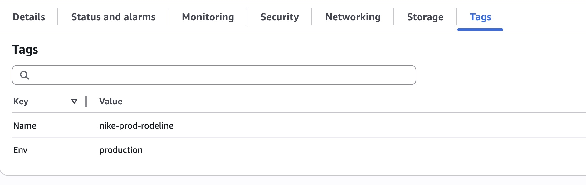
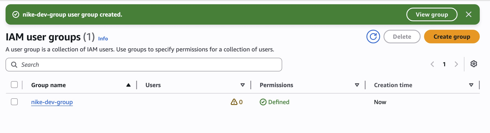
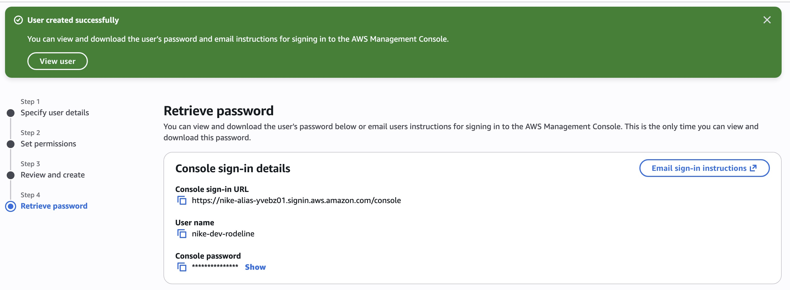
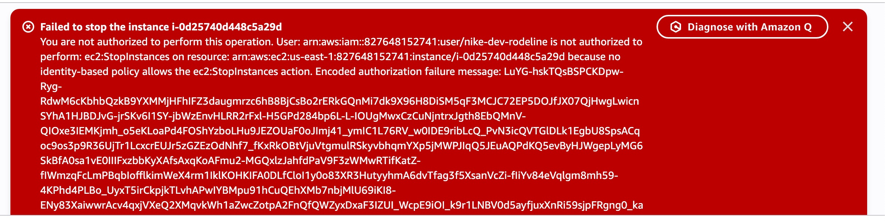
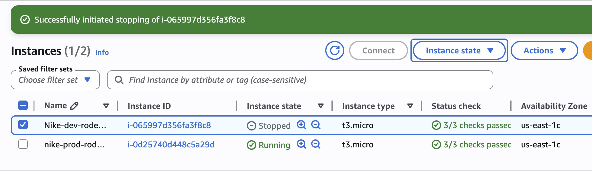
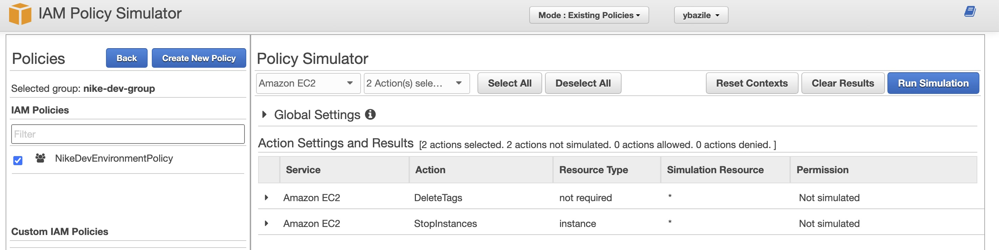
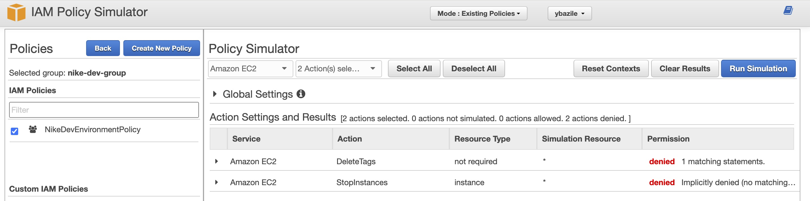

# Cloud Security with AWS IAM (Nike Scenario)

## Overview
In this project, I worked through a simulated scenario where I joined Nike as a DevOps engineer and was responsible for securely onboarding a new intern into the company’s AWS environment. The project focused on launching EC2 instances, implementing IAM access controls, and enforcing least-privilege permissions between development and production resources.

Using AWS IAM, I created tag-based policies that restricted the intern’s access to only development resources while protecting production infrastructure from unauthorized actions.

---

## Scenario: Joining Nike as a DevOps Engineer
Nike is preparing for increased website traffic during the holiday season and needs:
- Additional computing power for applications and services
- A secure onboarding process for new interns
- Protection for production infrastructure while allowing development access

My responsibilities in this project were to:
- Launch EC2 instances for production and development
- Configure secure IAM access controls
- Restrict intern access to development resources only
- Validate permissions through testing and policy simulation

---

# Key Outcomes
- Configured AWS EC2 production and development environments
- Implemented custom IAM policies using JSON
- Applied least-privilege access controls
- Restricted EC2 access using resource tags
- Created IAM users and groups for centralized permission management
- Prevented privilege escalation using explicit deny statements
- Validated permissions using the AWS IAM Policy Simulator

---

# Technologies Used
- AWS EC2
- AWS IAM
- IAM Policies
- IAM Users & Groups
- IAM Policy Simulator
- JSON
- Cloud Security Concepts
- Access Control & Least Privilege

---

# Access Control Design

The IAM policy was designed using the Principle of Least Privilege (PoLP). Instead of giving the intern unrestricted EC2 permissions, access was limited only to EC2 instances tagged with:

```text
Env = development
```

Production resources tagged:

```text
Env = production
```

remained protected from unauthorized actions.

Permissions were inherited through an IAM user group, allowing centralized permission management for future interns and developers.

To prevent privilege escalation, explicit deny statements were added to block:
- `ec2:CreateTags`
- `ec2:DeleteTags`

This prevented users from modifying resource tags to bypass security restrictions.

---

# What I Built

## 1. Launched EC2 Instances
Created two EC2 instances:
- **Production instance**
  - `Env = production`
- **Development instance**
  - `Env = development`

Implemented tag-based access controls for environment segmentation and permission enforcement.

---

## 2. Created a Custom IAM Policy
Created a JSON IAM policy that:
- Allowed EC2 actions only for resources tagged `Env = development`
- Allowed read-only EC2 visibility using `Describe*`
- Explicitly denied tag creation and deletion actions

### IAM Policy JSON

```json
{
  "Version": "2012-10-17",
  "Statement": [
    {
      "Effect": "Allow",
      "Action": "ec2:*",
      "Resource": "*",
      "Condition": {
        "StringEquals": {
          "ec2:ResourceTag/Env": "development"
        }
      }
    },
    {
      "Effect": "Allow",
      "Action": "ec2:Describe*",
      "Resource": "*"
    },
    {
      "Effect": "Deny",
      "Action": [
        "ec2:DeleteTags",
        "ec2:CreateTags"
      ],
      "Resource": "*"
    }
  ]
}
```

### Security Logic Behind the Policy
This policy demonstrates:
- Resource-level permissions using tags
- Conditional IAM access
- Explicit deny precedence
- Least-privilege access control
- Environment isolation between development and production

---

## 3. Set Up an AWS Account Alias
Created a custom AWS account alias to simplify authentication and improve account accessibility.

```text
nike-alias-yvebz01
```

---

## 4. Created IAM Users & User Groups
Configured centralized identity management by:
- Creating an IAM group for interns
- Attaching the custom IAM policy to the group
- Creating a dedicated IAM user:
  - `nike-dev-rodeline`
- Adding the user to the intern group

This allowed permissions to scale efficiently across multiple users without assigning permissions individually.

---

## 5. Tested IAM Permissions
Validated the IAM policy by logging in as the intern user and testing EC2 permissions.

### Results

| Action | Result |
|---|---|
| Stop Production Instance | Denied |
| Stop Development Instance | Allowed |

This confirmed the policy successfully enforced environment-specific access controls.

---

## 6. Used the IAM Policy Simulator
Used the AWS IAM Policy Simulator to safely validate permissions without impacting production resources.

### Simulated Actions
- `ec2:StopInstances`
- `ec2:DeleteTags`

### Observations
Initially, the simulator returned denied results because the simulation targeted all EC2 resources using `"Resource": "*"`. After specifying development-tagged resources, the simulator correctly allowed development actions while continuing to deny restricted tag-modification actions.

This helped reinforce how AWS evaluates:
- Explicit deny statements
- Conditional access rules
- Resource tag conditions
- Policy evaluation order

---

# Key Concepts Learned
- IAM Policy Structure
  - Effect
  - Action
  - Resource
  - Condition
- IAM Users & Groups
- Resource-Level Permissions
- Tag-Based Access Control
- Explicit Deny Precedence
- EC2 Instance Management
- IAM Policy Simulation
- Principle of Least Privilege (PoLP)

---

# Challenges
The most challenging part of this project was understanding how AWS evaluates permissions when combining:
- Allow statements
- Explicit deny statements
- Tag-based conditions
- Resource-level permissions

Using the IAM Policy Simulator helped me better understand how IAM policies are processed and evaluated in real-world scenarios.

---

# Looking Ahead
Next, I plan to continue building cloud security and AWS projects focused on:
- IAM best practices
- VPC networking
- Security groups and NACLs
- AWS CloudTrail
- Amazon GuardDuty
- Role-Based Access Control (RBAC)
- AWS monitoring and logging
- Cloud security automation

---

## 📸 Screenshots

Below are the screenshots documenting each step of the AWS IAM + EC2 Nike scenario project.

---

### **1. EC2 Instance Tags (Development Instance)**


### **2. EC2 Instance Tags (Production Instance)**


---

### **3. AMI Selection for EC2 Instance**


---

### **4. IAM Policy Details (Review & Create)**


---

### **5. AWS Account Alias Creation**


---

### **6. Creating IAM User Group (nike-dev-group)**


### **7. User Group Successfully Created**


---

### **8. Creating IAM User (nike-dev-rodeline)**


### **9. IAM User Review & Create**


### **10. IAM User Created Successfully**


---

### **11. Access Denied on Production Instance**


---

### **12. Successfully Stopped Development Instance**


---

### **13. IAM Policy Simulator — Initial State**


### **14. IAM Policy Simulator — Denied Results**


---

### **15. IAM User Limited Access (Service Catalog Denied)**


